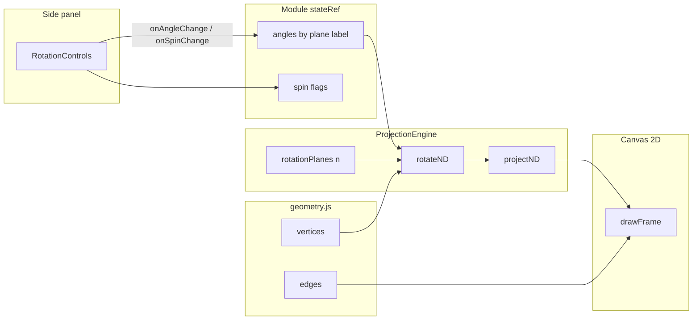

# Architecture

How the Hyperspace repo is structured today. Describes what exists in `src/` as of the shipped **Tesseract** module. Future work belongs in `docs/BACKLOG.md`, not here.

---

## Purpose

Hyperspace is a **module picker** plus a set of **self-contained sandboxes**. Each sandbox is a React component that owns its canvas (or plot), optional side panel, and module-local data (geometry, puzzles, dynamics). Shared code provides **n-dimensional rotation and projection math** and **generic UI widgets** — not module-specific behavior.

Stack: **Vite**, **React 18**, no 3D library. Rendering is **Canvas 2D**.

---

## Top-level layout

```
src/
├── main.jsx              ReactDOM entry
├── App.jsx               Module registry + picker + full-screen module shell
├── modules/
│   └── Tesseract/        Shipped reference module
│       ├── Tesseract.jsx
│       ├── geometry.js
│       └── puzzles.js
├── shared/
│   ├── ProjectionEngine.js
│   ├── RotationControls.jsx
│   └── PuzzlePanel.jsx
└── styles/
    └── global.css        CSS variables, base typography
```

Root `README.md` mentions `Tesseract/math.js`; that file **does not exist**. Tesseract imports rotation/projection from `shared/ProjectionEngine.js` directly.

---

## Module registration

Modules are **not** auto-discovered. `App.jsx` holds a static `modules` array:

```javascript
{
  id: 'tesseract',           // unique key for React + navigation
  name: 'Tesseract',         // display title
  subtitle: '...',           // card subtitle
  dimension: 4,              // shown on card (informational)
  status: 'ready' | 'coming', // only 'ready' cards are clickable
  component: Tesseract,      // default-exported React component (required when ready)
  description: '...',        // card body copy
}
```

**Navigation flow:**

1. Landing: `ModulePicker` renders cards from `modules`.
2. Click (if `status === 'ready'`): `setActiveId(id)`.
3. App re-renders: header with `← all modules` + `<ModComponent />` in a flex column filling the viewport.

Stub modules (`penteract`, `phase`, `iris`) have no `component` today. They must not be set to `ready` until a component exists — otherwise `App.jsx` will throw when resolving `mod.component`.

**Adding a module (contract):**

1. Create `src/modules/<Name>/<Name>.jsx` (default export).
2. Append entry to `modules` in `App.jsx`.
3. Set `status: 'ready'` when smoke-tested.

No router, no lazy loading, no global module context.

---

## Reference module: Tesseract composition

Tesseract is the template for **hypercube wireframe** modules (Penteract follows this).

### Responsibilities split

| Layer | Responsibility |
|-------|------------------|
| `geometry.js` | Combinatorial structure: vertex coordinates, edge list, cell membership. Pure data, no React. |
| `ProjectionEngine.js` | `rotationPlanes(n)`, `rotateND`, `projectND`, optional `projectVertices`. |
| `RotationControls.jsx` | Sliders + spin checkboxes for each plane label. |
| `PuzzlePanel.jsx` | Multiple-choice puzzles from a static array. |
| `Tesseract.jsx` | State, RAF loop, canvas draw, click handling, layout, wires shared + local pieces. |

### Data flow (rotation → projection → canvas)



**Step by step:**

1. **Initialization:** `N = 4`, `PLANES = rotationPlanes(N)`, build `angles` and `spin` objects keyed by plane label (`xy`, `xw`, …).
2. **User input:** Sliders update `stateRef.current.angles[label]`. Spin checkboxes set boolean per plane.
3. **Animation loop:** `requestAnimationFrame` increments angles for planes where `spin[label]` is true.
4. **Per frame:** For each vertex array `[x,y,z,w]`, call `rotateND(v, angles, PLANES)` then `projectND(rotated, opts)`.
5. **Screen mapping:** Scale projected `x,y` by canvas size (`scale ≈ min(W,H) * 0.22`), offset to center.
6. **Edges:** Draw line segments between projected vertex pairs; color/alpha from higher-dimensional depth (module-specific aesthetic).
7. **React re-render:** Sliders mirror `stateRef` via a `setTick` counter — canvas reads ref directly for performance; React only re-renders panel controls.

Phase Space and Iris **deviate** at steps 4–6 (no wireframe edges; different state), but wireframe modules should keep this pipeline.

---

## Shared infrastructure contract

### What shared code provides

**`ProjectionEngine.js`**

- `rotationPlanes(n)` → `[{ i, j, label }, …]` for all axis pairs.
- `rotateInPlane(p, i, j, theta)` — mutates array (internal).
- `rotateND(point, angles, planes)` — immutable point in, rotated array out.
- `projectND(point, opts)` — perspective collapse from dimension ≥3 down to 2D screen coords; returns `{ x, y, wFactor, lastHigherDimValue, z3 }`.
- `projectVertices(vertices, angles, planes, opts)` — batch convenience with scale/center.

**`RotationControls.jsx`**

- Props: `planes`, `angles`, `spin`, `onAngleChange`, `onSpinChange`, `threeDimensionalCount` (default 3).
- Planes with `j >= threeDimensionalCount` render in gold (`--accent-4d`); others blue (`--accent-3d`).

**`PuzzlePanel.jsx`**

- Props: `puzzles` (array), optional `onScoreChange(correct, attempted)`.
- Puzzle shape: `{ id, prompt, options, answer, reveal }`.
- Random selection without immediate repeat; no persistence.

### What a module must supply

- Default-exported React component filling available height.
- Its own canvas sizing / DPR handling (currently duplicated in Tesseract).
- Geometry or data (vertices, trajectories, CSV/JSON points).
- Puzzle definitions if using `PuzzlePanel`.
- Module-specific interactions (mark vertex, isolate cell, set IC, species toggle).

### What shared code must not assume

- Fixed dimension \(n\) (engine is generic; module sets `n`).
- Wireframe vs point cloud (Iris uses points only).
- Presence of cells, marks, or puzzles.

---

## Extension points (where new shared code should live)

Add to `src/shared/` when **second module** needs the same helper, or when extraction removes obvious duplication:

| Candidate | When |
|-----------|------|
| `TimeStepper.js` | Phase Space (and any future simulation module) needs RK4 / fixed-step integration. |
| `canvasSetup.js` | DPR resize boilerplate copied 3+ times. |
| `panelStyles.js` | Repeated `sectionLabel` / layout tokens across modules. |
| `hypercube.js` | Parameterized `buildVertices(n)`, `buildEdges(n)` shared by Tesseract + Penteract. |
| `dataLoader.js` | Second dataset module beyond Iris. |

Do **not** pre-build these before the first consumer exists.

---

## Styling and UX contract

- Global tokens in `global.css`: `--bg-base`, `--accent-3d`, `--accent-4d`, `--font-mono`, `--font-serif`.
- Side panel: `var(--bg-panel)`, ~340px width, collapsible via module-local button.
- Tone: instrument, not game. No confetti, no gating. Puzzle score is informational.

---

## Anti-patterns

**Module logic in `shared/`**  
Do not put pendulum equations, iris species colors, or 5-cube cell labels in shared files. Shared stays dimension-generic or UI-generic.

**God-object `ProjectionEngine`**  
Resist adding pendulum integration or CSV parsing to `ProjectionEngine.js`. Keep it rotation + projection only.

**Duplicated combinatorics without tests**  
Copying `geometry.js` for Penteract is acceptable once. If a third hypercube module appears, extract `hypercube.js` rather than copy a third time.

**React state on every animation frame**  
Tesseract correctly uses `stateRef` + RAF for angles; avoid `setState` per frame for canvas-driven modules.

**Premature `ready` in App.jsx**  
Setting `status: 'ready'` without `component` breaks navigation.

**Leaking Tesseract defaults**  
Default spin on `xw`, cell isolation UX, and edge coloring are Tesseract/Penteract choices — not shared defaults.

---

## Build and runtime

- `npm run dev` — Vite dev server, HMR.
- `npm run build` — production bundle.
- No environment variables, no backend, no asset pipeline beyond Vite.

Modules should keep assets **module-local** (e.g. `Iris/irisData.js`) unless shared data loading is extracted deliberately.

---

## Related documents

- `docs/MODULES.md` — planned behavior and open design questions per module.
- `docs/BACKLOG.md` — sequenced implementation tasks.
- Root `README.md` — quick start and high-level layout (may drift; architecture doc reflects Tesseract as implemented).
